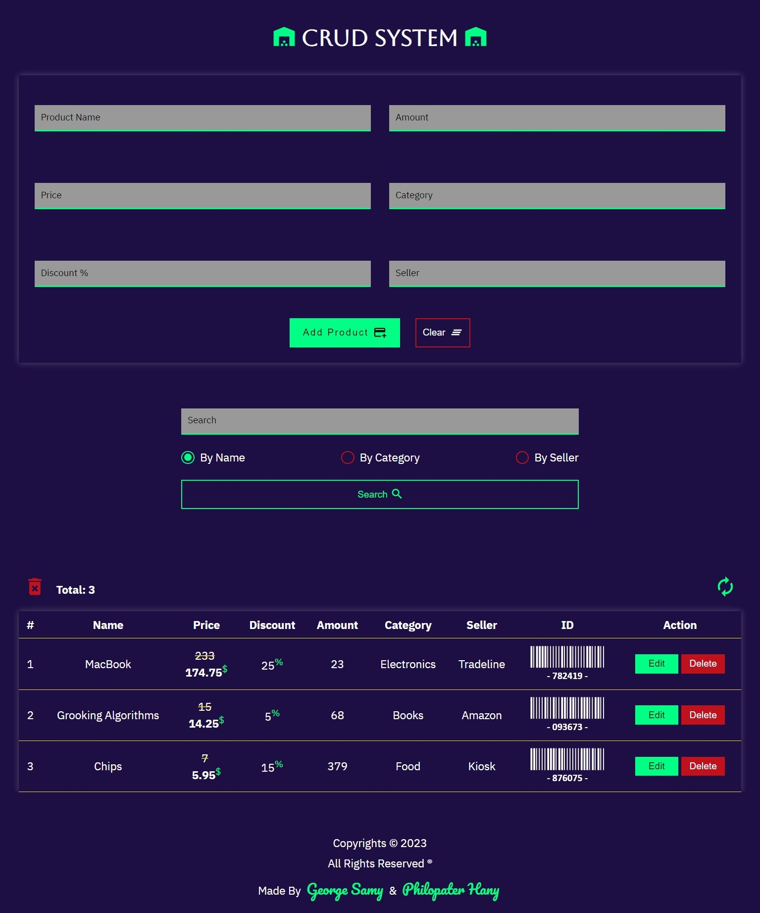

# CRUD System



## Table of contents

-   [Overview](#overview)
    -   [The challenge](#the-challenge)
    -   [Links](#links)
-   [Our process](#our-process)
    -   [Built with](#built-with)
    -   [What we learned](#what-we-learned)
    -   [Useful resources](#useful-resources)
-   [Authors](#authors)

## Overview

### The challenge

Users should be able to:

-   Load all products from database.
-   Add new products.
-   Delete products.
-   Empty database.
-   Update products' data.
-   Search by proudct's name/category/seller.
-   View a unique barcode and ID for each product.
-   View the optimal layout for the app depending on their device's screen size.
-   See hover states for all interactive elements on the page.

### Links

-   Live Site URL: [Github Pages](https://lorem.github.io/lorem/)
-   Live Site URL: [Vercel App](https://lorem.vercel.app/)

## Our process

### Built with

-   Semantic HTML5 Markup
-   CSS Custom Properties
-   AngularJS
-   TypeScript
-   Java
-   Spring Boot
-   MongoDB

### What We learned

```js
function generateID() {
    const numbers = [0, 1, 2, 3, 4, 5, 6, 7, 8, 9];
    const idLength = 6;
    let barcode = "";
    for (let i = 0; i < idLength; i++) {
        barcode += numbers[Math.floor(Math.random() * numbers.length)];
    }
    return barcode;
}
function generateBarCode(id: string) {
    JsBarcode(`#svg-${id}`, id, {
        format: "msi",
        height: 35,
        width: 1.5,
        text: "- " + id + " -",
        background: "transparent",
        lineColor: "#fff",
        font: "monospace",
        fontOptions: "bold",
        fontSize: 16,
        margin: 2,
        textMargin: 2,
    });
}
```

### Useful resources

-   [AngularJS Docs](https://angular.io/docs)
-   [JsBarcode](https://lindell.me/JsBarcode/)
-   [Sweetalert2](https://sweetalert2.github.io/)
-   [Material Icons](https://developers.google.com/fonts/docs/material_icons)

## Authors

-   Github Account: [George Samy](https://github.com/GeorgeBeshay)
-   Github Account: [Philopater Hany](https://github.com/PhilopaterHany)
